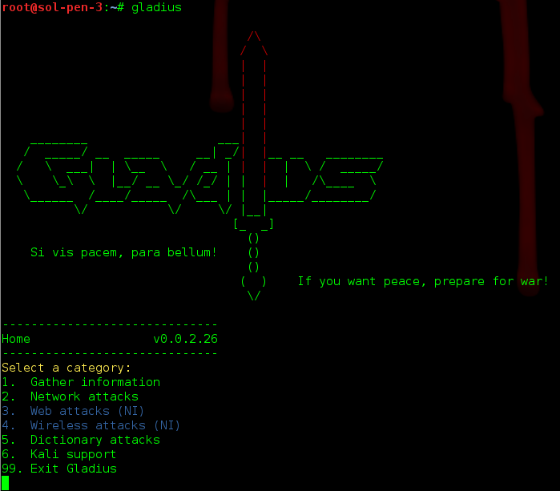

# Gladius
An interactive shell for common Kali Linux tasks

## Warning
This app is Alpha, so beware. I will be making significant changes between now and the Beta release, v0.1.

## Install
Change directory and clone:

`cd /opt;git clone https://github.com/pS3ud0RAnD0m/gladius`

Symlink:

`ln -s /opt/gladius/gladius.rb /usr/bin/gladius;cd`

Run from anywhere:

`gladius`

## Update
Change to the gladius directory and pull the newest commit:

`cd /opt/gladius;git pull`

## Usage

## Contributors
##### Michael Born
* Provided User Interface recommendations
* Alpha testing
* Improved Windows dictionary list

##### Steve Pittinger
* Improved DiG commands for identifying DCs
* Recommended TestSSLServer
* Alpha testing

##### Steve Seideman
* Improved Windows dictionary list
* Alpha testing

##### Will Caput
* Recommended subbrute.py

## Issues

Please submit to:
https://github.com/pS3ud0RAnD0m/gladius/issues

## Comments and Questions

Feel free to email me at ps3ud0.rand0m@gmail.com
